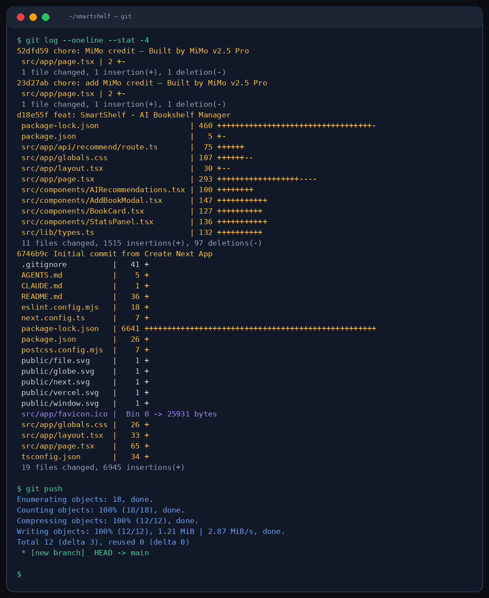

# 📚 Smart Shelf

Your personal AI-powered bookshelf. Track what you've read, what you're reading, and what's next. Get AI recommendations based on your taste.



## What you can do

**Manage your library:**
- Add books with title, author, genre, and reading status
- Search across your entire collection
- Filter by status (reading / completed / want to read) and genre
- View stats: total books, pages read, genre breakdown

**AI-powered recommendations:**
- Get personalized book suggestions based on your shelf
- Powered by MiMo v2.5 Pro reasoning engine
- Recommendations adapt as your library grows

**Data stays local:**
- Everything saved to localStorage
- No account needed, no data sent to servers
- Works offline after first load

## Quick start

```bash
npm install && npm run dev
```

## Architecture

```
src/
├── app/
│   ├── api/recommend/route.ts   # AI recommendation endpoint
│   ├── page.tsx                 # Main bookshelf view
│   ├── globals.css              # Gold/amber library theme
│   └── layout.tsx
├── components/
│   ├── BookCard.tsx             # Individual book display
│   ├── AddBookModal.tsx         # New book form
│   ├── StatsPanel.tsx           # Reading statistics
│   └── AIRecommendations.tsx    # AI suggestion panel
├── lib/
│   └── types.ts                 # TypeScript types + sample data
```

## Tech

| Tool | Purpose |
|------|---------|
| Next.js 16 | Framework |
| Tailwind CSS 4 | Styling |
| TypeScript | Type safety |
| MiMo v2.5 Pro | AI recommendations |
| localStorage | Client-side persistence |

## Design

Warm library aesthetic. Gold (#d4a843) and amber accents on dark navy (#0f172a). Playfair Display serif headings, Inter body text. Subtle dot-grid background texture.

---

Built with **MiMo v2.5 Pro** by Xiaomi — [huggingface.co/XiaomiMiMo](https://huggingface.co/XiaomiMiMo)

*Crafted with MiMo v2.5 Pro*

MIT
